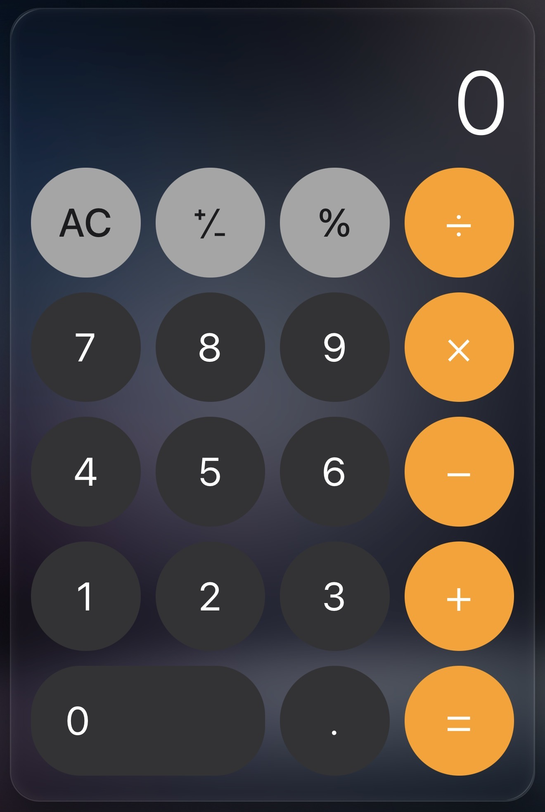
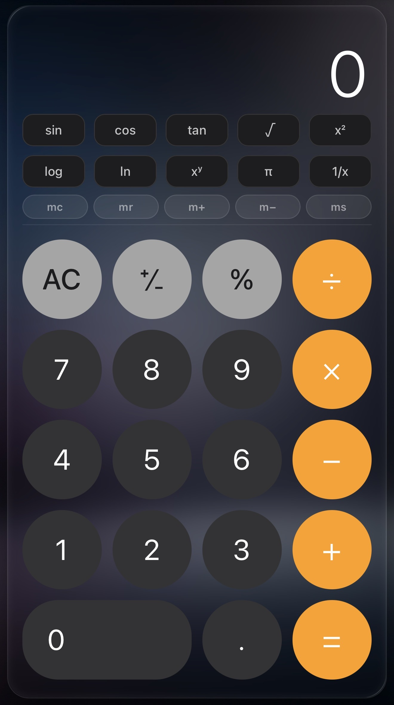
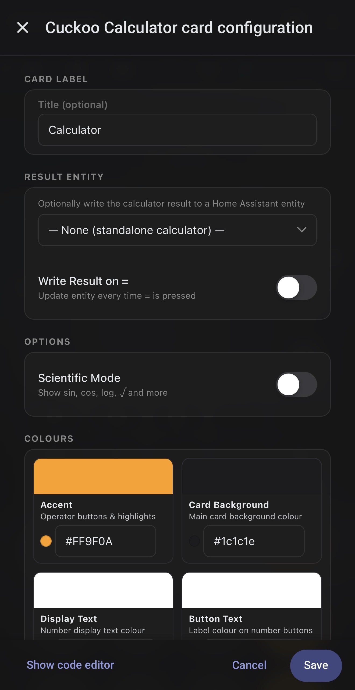

# Cuckoo Calculator Card

A sleek, dark-glass calculator card for Home Assistant. Supports writing results to HA entities, scientific mode, frosted memory pill buttons, keyboard input, and a full visual configuration editor. Optimised for iPhone Dashboards.







## Key Features

- **Dark glass design** — frosted card with colour-coded operator buttons, large display and rounded keys
- **Full arithmetic** — add, subtract, multiply, divide, percentage, sign toggle and decimal input
- **Memory pills** — mc, mr, m+, m− and ms as frosted-glass pill buttons; pills highlight when memory holds a value
- **Scientific mode** — sin, cos, tan, log, ln, √, x², 1/x, π and xʸ; toggled on or off from the visual editor
- **Writes results to HA entities** — optionally push the `=` result to any `input_number` or `number` entity
- **Keyboard support** — type numbers and operators from a full keyboard; Backspace deletes; Escape clears; Enter evaluates
- **Haptic feedback** — vibrates on button press on supported mobile devices (can be disabled)
- **Swipe down to clear** — swipe down on the display to trigger All Clear on touch screens
- **Live expression display** — shows the current expression above the main number as you build it
- **AC / C toggle** — automatically switches between All Clear and Clear Entry
- **Active operator highlight** — the selected operator inverts to white-on-accent while waiting for the next operand
- **Visual editor** — full WYSIWYG editor with colour pickers, entity selector and toggles — no YAML required

## Quick Start

```yaml
type: custom:cuckoo-calculator-card
```

## Credits

Built to match the visual style and editor patterns of [Crow Media Player Card](https://github.com/jamesmcginnis/crow-media-player-card).
